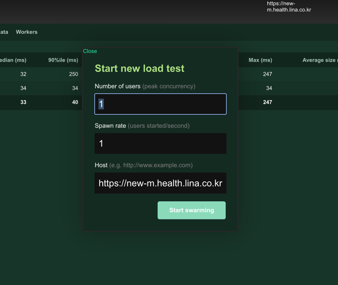

# Locust Docker

http 서버 부하 테스트를 위한 모듈입니다. docker image로 실행되며 작성한 테스트 코드를 docker-compose 설정에 추가하면 적용됩니다.

## compose.yml

```yaml
version: '3'

services:
  master:
    image: locustio/locust
    # 관리 콘솔 포트
    ports:
     - "8089:8089"
    volumes:
      - ./:/mnt/locust
    # -H 옵션으로 타겟 서버 주소를 입력
    # 프로젝트 루트에 있는 locustfile.py 를 사용(/mnt/locust 는 docker 이미지 내부 경로)
    command: -f /mnt/locust/locustfile.py --master -H https://new-m.health.lina.co.kr

  worker:
    image: locustio/locust
    volumes:
      - ./:/mnt/locust
    command: -f /mnt/locust/locustfile.py --worker --master-host master
```

위 설정 파일을 수정한 후 docker-compose 실행 시 테스트 서비스가 구동됩니다.

## 관리 콘솔



localhost:8089(설정으로 변경 가능) 접속 후 동시 접속자 수 및 request 빈도 설정을 할 수 있습니다.

